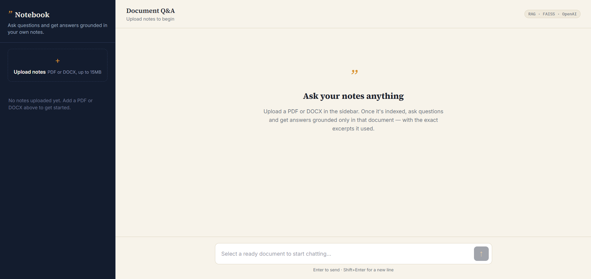
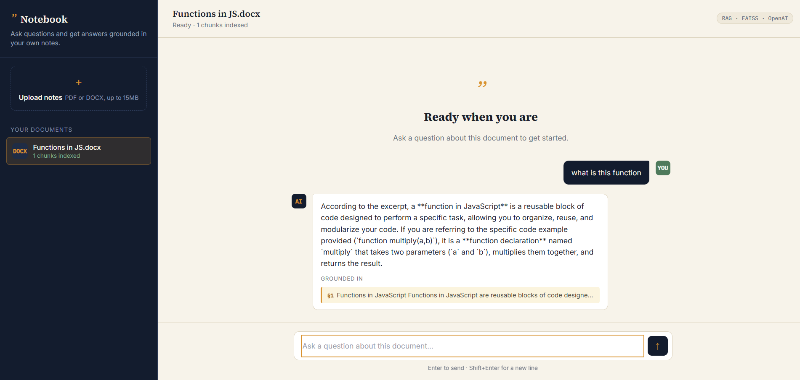
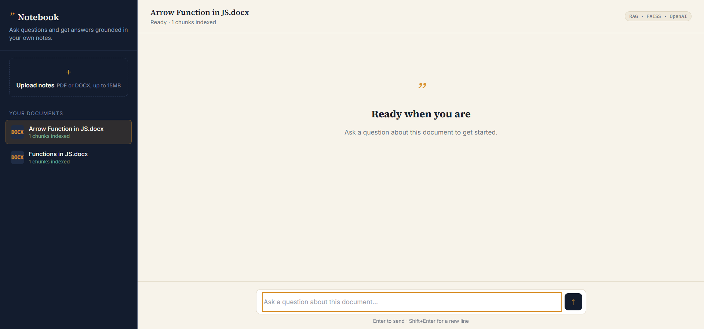
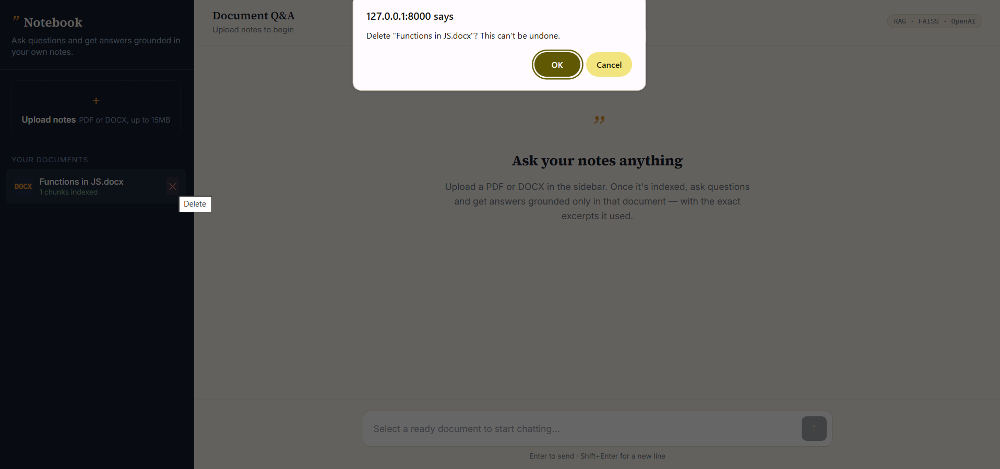

# 📓 Notebook — Document Q&A Bot

Upload your notes (PDF or DOCX) and ask questions about them. Answers are generated using RAG (Retrieval-Augmented Generation) — the bot only answers from what's actually in your document, and shows you the exact excerpts it used, instead of relying on the model's general knowledge.

---

## ✨ Features

- 📄 Upload **PDF** and **DOCX** files
- 💬 Ask natural-language questions about the document
- 🧠 **RAG-powered** grounded answers
- 🔍 Shows the **source excerpts** used to answer
- 📚 Per-document chat sessions
- ⚡ Fast semantic search with **FAISS**
- 🌐 Django REST API + responsive frontend
- 🗑️ Delete documents and chat history

---

## 🖼️ Screenshots

### 🏠 Home Page


### 📊 Analysis Page


### 💬 Stored Chat Page


### 🗑️ Delete Chat Page


---
## 🔍 How it works

1. **Ingestion** — your file is parsed (`pdfplumber` for PDF, `python-docx`
   for DOCX) and split into overlapping text chunks.
2. **Embedding** — each chunk is converted into a vector via Gemini's
   embeddings API and stored in a per-document **FAISS** index.
3. **Retrieval** — when you ask a question, it's embedded too, and FAISS
   finds the most semantically similar chunks.
4. **Generation** — those chunks are passed to Gemini along with your question,
   with instructions to answer only from that context.

## 🛠️ Tech stack

- **Backend:** Django 5 + Django REST Framework
- **Vector search:** FAISS (in-process, no separate server needed)
- **LLM:** Google Gemini API (`models/gemini-embedding-001` + `models/gemini-flash-latest` by default) - free tier, no credit card required
- **Frontend:** vanilla HTML/CSS/JS, served directly by Django (no build step)
- **Database:** SQLite (swap for Postgres in production by changing `DATABASES`)

## ⚙️ Setup

### 1. Clone and create a virtual environment

```bash
python -m venv venv
source venv/bin/activate      # Windows: venv\Scripts\activate
pip install -r requirements.txt
```

### 2. Configure environment variables

```bash
cp .env.example .env
```

Open `.env` and add your Gemini API key - get a free one (no credit card needed)
at https://aistudio.google.com/apikey. The other defaults are fine to start.

### 3. Run migrations

```bash
python manage.py migrate
```

### 4. (Optional) create an admin user

```bash
python manage.py createsuperuser
```

This lets you inspect uploaded documents, chunks, and chat history at
`/admin/`.

### 5. Run the server

```bash
python manage.py runserver
```

Visit **http://127.0.0.1:8000/** — upload a PDF or DOCX from the sidebar,
wait for it to finish indexing, then start asking questions.

## 📁 Project structure

```
document_qa_bot/
├── qa_bot/                  # Django project settings, root URLs
├── documents/                # Main app
│   ├── models.py            # Document, Chunk, ChatSession, ChatMessage
│   ├── views.py              # Upload + chat API endpoints
│   ├── serializers.py
│   ├── urls.py
│   ├── services/
│   │   ├── ingestion.py     # PDF/DOCX → text → chunks
│   │   ├── embeddings.py    # Gemini embeddings + FAISS index management
│   │   └── rag.py           # Retrieval + grounded answer generation
│   ├── static/documents/     # CSS + JS for the frontend
│   └── templates/documents/  # index.html
├── vector_indexes/           # FAISS index files (one per document, generated)
├── media/uploads/            # Uploaded source files (generated)
└── requirements.txt
```

## 🔌 API endpoints

| Method | Endpoint | Purpose |
|---|---|---|
| GET | `/api/documents/` | List uploaded documents |
| POST | `/api/documents/` | Upload + process a new document (`file` field) |
| DELETE | `/api/documents/<id>/` | Delete a document, its chunks, and its index |
| POST | `/api/documents/<id>/sessions/` | Start a chat session for a document |
| GET | `/api/sessions/<id>/` | Fetch a session and its message history |
| POST | `/api/sessions/<id>/messages/` | Ask a question (`content` field) |

## 🚀 Deploying to Render

This repo includes `render.yaml`, `build.sh`, and production-ready settings
(whitenoise for static files, `gunicorn` as the app server, `DATABASE_URL`
support), so deployment is mostly point-and-click.

1. **Push this repo to GitHub** (see the section above) if you haven't already.
2. On [Render](https://render.com), click **New → Blueprint**, connect your
   GitHub account, and select this repository. Render will read `render.yaml`
   and configure the web service automatically.
3. When prompted, set the **`OPENAI_API_KEY`** environment variable — this is
   the only value not auto-generated, and Render deliberately won't show it
   in `render.yaml` since it's a secret.
4. Click **Apply**. Render will run `build.sh` (install deps, collect static
   files, run migrations) and then start the app with `gunicorn`.
5. Once it's live, your app is at `https://<your-service-name>.onrender.com`.

### 💾 About data persistence

Render's **free tier has ephemeral disk** — the filesystem resets on every
redeploy. This app currently stores three things on disk: the SQLite
database, uploaded files (`media/uploads/`), and FAISS indexes
(`vector_indexes/`). That means on the free tier, **uploaded documents and
chat history disappear each time you redeploy** (they survive normal
restarts/spin-downs, just not new deploys). For a portfolio demo this is
usually fine — just re-upload a sample document after any redeploy.

If you want data to persist properly, you have two upgrade paths:

- **Easiest partial fix:** attach a Render **Postgres** database (free tier
  available) and set its connection string as `DATABASE_URL` — this makes
  your chat history and document metadata persistent. Uploaded files and
  FAISS indexes still won't be, since those are plain files, not DB rows.
- **Full fix:** upgrade the web service to a paid **Starter** plan and attach
  a [persistent disk](https://render.com/docs/disks), then point `MEDIA_ROOT`
  and `VECTOR_INDEX_DIR` in `settings.py` at a path under that disk's mount
  point (e.g. `/var/data/media`, `/var/data/vector_indexes`). This is the
  right setup for anything beyond a demo.

## ⚠️ Notes & known limitations

- Scanned/image-only PDFs aren't supported (no OCR yet) — text-based PDFs and
  DOCX only.
- Document processing (extraction → embedding → indexing) currently runs
  synchronously in the request. Fine for portfolio-sized documents; for large
  files or many concurrent uploads, move this to a background task queue
  (e.g. Celery).
- FAISS indexes are stored on local disk (`vector_indexes/`). This is the
  simplest possible setup for learning RAG. A natural next step, if you want
  a resume line that names a production vector database, is swapping FAISS
  for **Qdrant** — the retrieval logic in `services/embeddings.py` is
  isolated specifically so that swap doesn't touch the rest of the app.
- No authentication yet — all documents are currently visible to anyone
  using the app. Add Django auth + scope documents to `request.user` before
  deploying anywhere public.

## 🔑 Environment variables

See `.env.example` for the full list. Key ones:

| Variable | Purpose | Default |
|---|---|---|
| `GEMINI_API_KEY` | Your Gemini API key (free) | — required |
| `EMBEDDING_MODEL` | Embedding model | `models/gemini-embedding-001` |
| `CHAT_MODEL` | Chat/generation model | `models/gemini-flash-latest` |
| `CHUNK_SIZE_TOKENS` | Chunk size for splitting documents | `350` |
| `CHUNK_OVERLAP_TOKENS` | Overlap between chunks | `50` |
| `TOP_K_CHUNKS` | How many chunks to retrieve per question | `4` |

## 🧭 A note on model names

Google renames and retires Gemini models periodically (this project uses
`models/gemini-flash-latest` and `models/gemini-embedding-001` as of when this was
written). If you get a "model not found" or `404` error, run this to see
exactly which models your own API key currently has access to:

```bash
python manage.py list_gemini_models
```

It prints two lists - one for `EMBEDDING_MODEL`, one for `CHAT_MODEL`. Copy
the exact name of one from each into your `.env` file.

---

## 🔮 Future Improvements

- 🔐 User authentication
- 📥 Background processing with Celery
- 🖼️ OCR for scanned PDFs
- ☁️ Qdrant / Pinecone support
- 📝 Conversation memory

---

## 🎯 Why I Built This

I built this project to learn the core ideas behind **production RAG systems**:

- Document ingestion
- Text chunking
- Vector embeddings
- Semantic retrieval
- Grounded answer generation
- Source attribution

The goal was to create a **lightweight, self-contained document assistant** without relying on an external vector database.

---